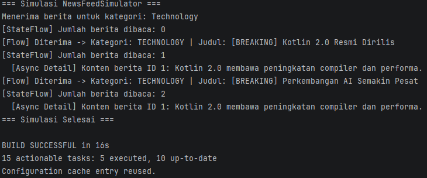

# NewsFeedSimulator - Kotlin Multiplatform (JVM / Desktop Target)

Aplikasi **NewsFeedSimulator** adalah proyek Kotlin Multiplatform yang mensimulasikan aliran berita (news feed) secara real-time menggunakan Kotlin Coroutines dan Flows.

---
## Data Diri

Nama    : Habbi Widagdo  
NIM     : 123140204  
Kelas   : Pengembangan Aplikasi Mobile RA

---

## 1. Lokasi File Aplikasi

File utama logika aplikasi berada pada modul shared untuk target JVM/Desktop:
- [`Platform.jvm.kt`](./app/shared/src/jvmMain/kotlin/com/example/newsfeedsimulator/Platform.jvm.kt)

---

## 2. Alur Logika (Logic Flow)

Alur kerja aplikasi dirancang secara reaktif dan asinkron tanpa memerlukan input interaktif dari pengguna:
1. **Inisialisasi ViewModel & Repository**: `NewsViewModel` diinisialisasi dengan `NewsRepository` yang menyimpan daftar data berita statis.
2. **StateFlow Pengamatan Jumlah Baca**: `readCount` (StateFlow) memantau jumlah berita yang telah dibaca dan mencetak perubahannya secara real-time.
3. **Flow Simulasi Berita & Filter/Transformasi**:
   - `newsFlow()` memancarkan data berita baru secara berurutan setiap **2 detik**.
   - Berita difilter berdasarkan kategori tertentu (misal: `"Technology"`).
   - Data berita ditransformasikan ke format tampilan (`NewsUiModel`).
4. **Coroutine Detail Berita**: Setiap kali berita diterima, aplikasi memanggil fungsi suspend untuk mengambil detail berita secara asynchronous dengan simulasi delay jaringan selama **1 detik**.

### Hasil Luaran



---

## 3. Penjelasan Kode per Fitur

### A. Flow Simulasi Berita Baru (Setiap 2 Detik)
Berita dipancarkan satu per satu secara periodik menggunakan `flow` builder dan `delay(2000)`.

```kotlin
fun newsFlow(): Flow<News> = flow {
    for (news in newsList) {
        emit(news)
        delay(2000) // Delay 2 detik antar berita
    }
}
```

### B. Filter Berita Berdasarkan Kategori
Operator `.filter` digunakan untuk menyaring berita hanya untuk kategori tertentu (misalnya `"Technology"`).

```kotlin
fun getFilteredAndTransformedNewsFlow(targetCategory: String): Flow<NewsUiModel> {
    return newsRepository.newsFlow()
        .filter { it.category == targetCategory }
        .map { news ->
            NewsUiModel(
                displayTitle = "[BREAKING] ${news.title}",
                categoryLabel = news.category.uppercase()
            )
        }
}
```

### C. Transformasi Data Menjadi Format Tampilan
Operator `.map` mengubah entitas `News` mentah menjadi `NewsUiModel` yang siap ditampilkan di UI.

```kotlin
data class NewsUiModel(
    val displayTitle: String,
    val categoryLabel: String
)
```

### D. StateFlow untuk Menyimpan Jumlah Berita yang Sudah Dibaca
Menggunakan `MutableStateFlow` untuk menyimpan status reaktif jumlah berita yang telah dibaca/diproses.

```kotlin
private val _readCount = MutableStateFlow(0)
val readCount: StateFlow<Int> = _readCount.asStateFlow()

fun markNewsAsRead() {
    _readCount.value++
}
```

### E. Coroutines untuk Mengambil Detail Berita secara Async
Fungsi `suspend` dengan `delay(1000)` mensimulasikan operasi jaringan asynchronous (network call) untuk mengambil detail berita berdasarkan ID.

```kotlin
suspend fun getNewsDetail(id: Int): News? {
    delay(1000) // Simulasi network delay
    return newsList.find { it.id == id }
}
```

---

## 4. Setup Environment & Konfigurasi Gradle

Untuk menjalankan aplikasi ini pada target JVM (Desktop), environment proyek Kotlin Multiplatform perlu dikonfigurasi dengan menambahkan target `jvm()` pada file build Gradle shared module.

### Konfigurasi Target JVM dan COROUTINES di `app/shared/build.gradle.kts`:

```kotlin
kotlin {
    jvm() // Mengaktifkan target JVM/Desktop
    
    sourceSets {
        commonMain.dependencies {
            implementation(libs.compose.runtime)
            implementation(libs.compose.foundation)
            implementation(libs.compose.material3)
            // Coroutines Dependency
            implementation("org.jetbrains.kotlinx:kotlinx-coroutines-core:1.8.0")
        }
    }
}
```

### Cara Menjalankan Simulasi (JVM):
Anda dapat menjalankan fungsi `main` langsung dari IDE (Android Studio / IntelliJ IDEA) pada file [`Platform.jvm.kt`](./app/shared/src/jvmMain/kotlin/com/example/newsfeedsimulator/Platform.jvm.kt) atau melalui Gradle:
```bash
./gradlew :app:shared:run
```